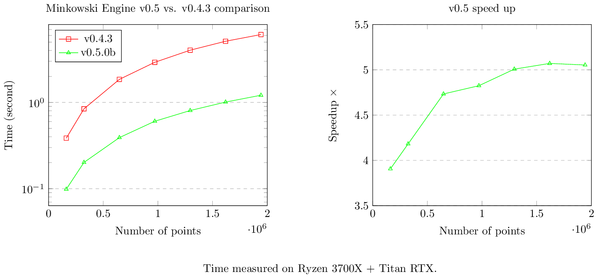

# Minkowski Engine Benchmark

## MinkUNet14 (25 conv layers)

Ryzen 3700X + Titan RTX

|                                      | v0.5          | speed up    | v0.4.3       |
|--------------------------------------|---------------|-------------|--------------|
| Number of Non-zero Elements (Points) | Time          | x           | Time         |
|                               161890 | 0.09865355492 | 3.906438882 | 0.3853840828 |
|                               323780 |   0.201720953 | 4.181743076 | 0.8435451984 |
|                               647560 |  0.3909289837 | 4.733338619 |  1.850399256 |
|                               971340 |  0.6050679684 | 4.824337556 |  2.919052124 |
|                              1295120 |  0.8053011894 | 5.007231003 |  4.032329082 |
|                              1618900 |   1.009372473 | 5.070545621 |  5.118069172 |
|                              1942680 |   1.211565018 | 5.053071509 |  6.122124672 |

