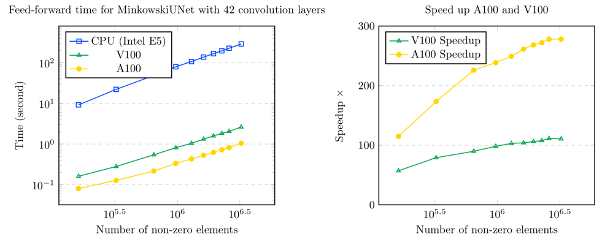
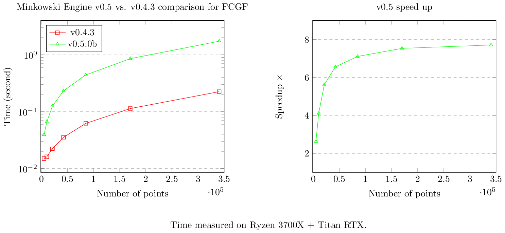

# Minkowski Engine Benchmark

## MinkUNet34 (42 conv layers)

### Time to process a sparse tensor

| Number of Non-zero Elements (NNZ) |       CPU (E5)      |          V100         |  A100              |
|-----------------------------------|---------------------|-----------------------|--------------------|
| 161890                            |  9.189684867858887  |  0.1606714725494384   |0.0800826549530029  |
| 323780                            |  22.11437630653381  |  0.2796809673309326   |0.1274714469909668  |
| 647560                            |  48.82245087623596  |  0.5429468154907227   |0.2160387039184570  |
| 971340                            |  79.74007511138916  |  0.8115856647491455   |0.3341245651245117  |
| 1295120                           |  107.2188804149627  |  1.0402274131774902   |0.4301359653472900  |
| 1618900                           |  137.5616581439972  |  1.3221232891082764   |0.5263621807098389  |
| 1942680                           |  167.6317486763000  |  1.578477144241333    |0.624725341796875   |
| 2266460                           |  196.8181667327881  |  1.8281619548797607   |0.7229833602905273  |
| 2590240                           |  227.5360894203186  |  2.0409200191497803   |0.8182036876678467  |
| 3237800                           |  290.2604696750641  |  2.6243700981140137   |1.0436716079711914  |

### Speedup over CPU

| Number of Non-zero Elements (NNZ) |          V100      |  A100          |
|-----------------------------------|--------------------|----------------|
| 161890                            |  57.19549788174895 |114.75250006698 |
| 323780                            |  79.07000793646057 |173.48493979283 |
| 647560                            |  89.92123995074834 |225.98937130572 |
| 971340                            |  98.25219761124805 |238.65373406972 |
| 1295120                           |  103.0725388090386 |249.26741554474 |
| 1618900                           |  104.0460139211203 |261.34411472816 |
| 1942680                           |  106.1984009637777 |268.32871577475 |
| 2266460                           |  107.6590431211183 |272.23056233783 |
| 2590240                           |  111.4870192292528 |278.09223161639 |
| 3237800                           |  110.6019573548936 |278.11475128590 |

## MinkUNet14 (25 conv layers)

Ryzen 3700X + Titan RTX

|                                      | v0.5b         | speed up    | v0.4.3       |
|--------------------------------------|---------------|-------------|--------------|
| Number of Non-zero Elements (Points) | Time          | x           | Time         |
|                               161890 | 0.09865355492 | 3.906438882 | 0.3853840828 |
|                               323780 |   0.201720953 | 4.181743076 | 0.8435451984 |
|                               647560 |  0.3909289837 | 4.733338619 |  1.850399256 |
|                               971340 |  0.6050679684 | 4.824337556 |  2.919052124 |
|                              1295120 |  0.8053011894 | 5.007231003 |  4.032329082 |
|                              1618900 |   1.009372473 | 5.070545621 |  5.118069172 |
|                              1942680 |   1.211565018 | 5.053071509 |  6.122124672 |

Ryzen 3700X + Titan RTX ITX

|                                      | v0.5c        | speed up    | v0.5b               |
|--------------------------------------|--------------|-------------|---------------------|
| Number of Non-zero Elements (Points) | Time         | x           | Time                |
|                               161890 | 0.118088483  | 1.301948924 | 0.1537451744079589  |
|                               323780 | 0.224587202  | 1.420111955 | 0.3189389705657959  |
|                               647560 | 0.429016828  | 1.448982926 | 0.6216380596160889  |
|                               971340 | 0.675571441  | 1.431851259 | 0.9673178195953369  |
|                              1295120 | 0.895347356  | 1.433548963 | 1.2835242748260498  |
|                              1618900 | 1.114722967  | 1.443795053 | 1.609431505203247   |
|                              1942680 | 1.339769125  | 1.448891065 | 1.9411795139312744  |

## Fully Convolutional Geometric Features [FCGF](https://github.com/chrischoy/FCGF) (21 conv layers)

ResUNetBN2C on Ryzen 3700X + Titan RTX

|                                      | v0.5b         | speed up    | v0.4.3       |
|--------------------------------------|---------------|-------------|--------------|
| Number of Non-zero Elements (Points) | Time          | x           | Time         |
|                           5322       | 0.014988899   | 2.631752243 | 0.0394470691 |
|                           10644      | 0.016107559   | 4.11098283  | 0.0662178993 |
|                           21288      | 0.022331714   | 5.615388722 | 0.1254012585 |
|                           42576      | 0.035487651   | 6.560935463 | 0.2328321934 |
|                           85152      | 0.062259197   | 7.109369136 | 0.4426236153 |
|                           170304     | 0.113505363   | 7.534897789 | 0.8552513123 |
|                           340608     | 0.224957943   | 7.712351967 | 1.734954834  |

ResUNetBN2C on Ryzen 3700X + Titan RTX ITX

|                                      | v0.5c         | speed up    | v0.5b        |
|--------------------------------------|---------------|-------------|--------------|
| Number of Non-zero Elements (Points) | Time          | x           | Time         |
|                           5322       | 0.0139970779  | 1.015772975 | 0.0142178535 |
|                           10644      | 0.0171124935  | 1.005572968 | 0.0172078609 |
|                           21288      | 0.0207984447  | 1.046483632 | 0.0217652320 |
|                           42576      | 0.0319116115  | 1.075287453 | 0.0343141555 |
|                           85152      | 0.0537533760  | 1.117707066 | 0.0600805282 |
|                           170304     | 0.0964894294  | 1.139130628 | 0.1099140644 |
|                           340608     | 0.1927807331  | 1.144459244 | 0.2206296920 |
